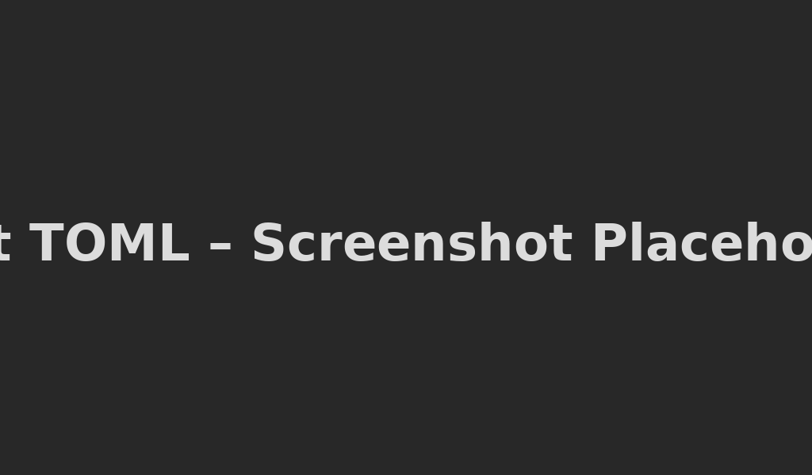

# 📘 Best TOML — A lightweight TOML extension for VS Code

**Best TOML** bringt sauberes, modernes TOML-Syntax-Highlighting in Visual Studio Code.  
Ideal für:

- `pyproject.toml`  
- `Cargo.toml`  
- `uv` / `Ruff` / `Poetry`-Setups  
- alle TOML-basierten Konfigurationsdateien  

Die Extension ist bewusst **leichtgewichtig, schnell und wartbar** gehalten – keine Abhängigkeiten, kein LSP, nur pures Highlighting und Language-Configuration.

---

## ✨ Features

- Syntax-Highlighting für TOML 1.x  
- Unterstützung für:
  - Tabellen (`[table]`, `[[array.of.tables]]`)
  - Schlüssel/Werte
  - Strings (single/double quoted)
  - Zahlen, Floats, Hex, Binary, Octal
  - Booleans
  - Datums- und Zeitformate (RFC 3339)
- Kommentar-Highlighting (`#`)
- Auto-Brackets, Auto-Quotes
- `.toml`-Erkennung automatisch

---

## 🖼️ Screenshot

> Platzhalter – du kannst hier später einen echten Screenshot einfügen.

```markdown

```

---

## 📦 Installation

### ▶️ Visual Studio Marketplace

*(Sobald veröffentlicht)*  
1. In VS Code: **Extensions** öffnen (`Ctrl+Shift+X`)  
2. Nach **“Best TOML”** suchen  
3. Installieren & genießen

### 📥 Manuell aus `.vsix`

1. `.vsix` herunterladen  
2. In VS Code:
   - Extensions → `⋯` → **Install from VSIX…**
3. Datei auswählen  
4. VS Code neu laden

---

## 🧪 Verwendung

Einfach eine `.toml`-Datei öffnen.  
VS Code erkennt TOML automatisch und aktiviert die Extension.

---

## 🔧 Dateitypen

| Typ             | Erkennung                         |
|-----------------|-----------------------------------|
| `.toml`         | wird automatisch als TOML erkannt |
| `pyproject.toml`| vollständig unterstützt           |
| `Cargo.toml`    | vollständig unterstützt           |

---

## 🚧 Roadmap

Geplant für zukünftige Versionen:

- Verbesserte Grammatik für spezielle Tool-Ökosysteme (Ruff, Poetry, uv)
- Optionale TOML-Validierung über LSP / Schema
- Weitere Quality-of-Life-Verbesserungen

---

## 🙌 Contribution

Pull Requests sind willkommen!

Repo:  
https://github.com/rherre86/best-toml

Issues:  
https://github.com/rherre86/best-toml/issues

---

## 📄 License

MIT License  
© 2025 Robert Herre

---

## ⭐ Feedback

Wenn dir die Extension gefällt, freue ich mich über:

- ein ⭐ auf GitHub  
- eine Bewertung im VS Code Marketplace  
